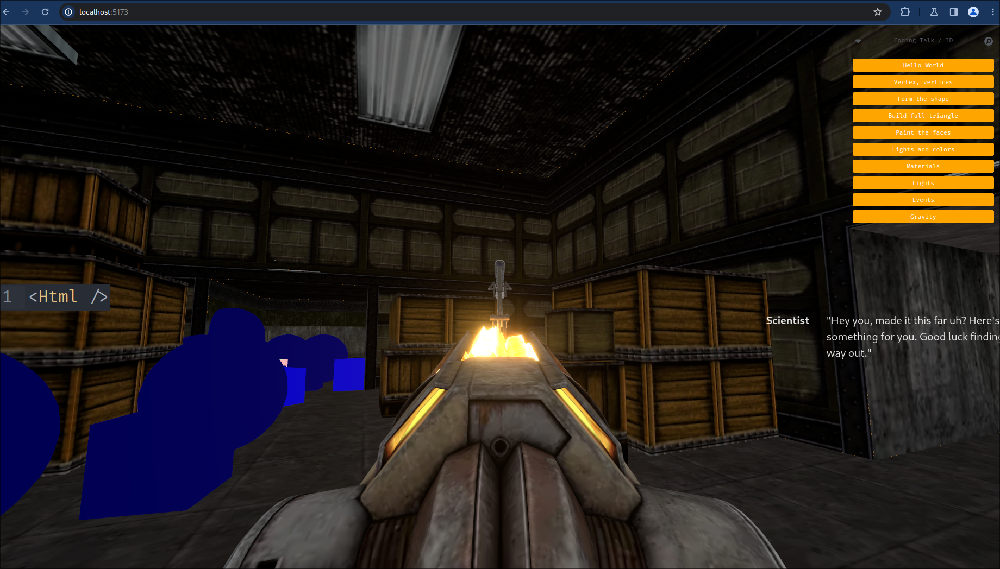

# Coding Talk - Introduction to 3D in the Browser with Three.js and React

## What Is This About?

This repository contains the code for a presentation I gave on the Coding Lab Discord channel. While the project is far from perfect—I was constrained by time and had to cut some corners—it's a working demo that you can clone, run, or modify as you see fit.

## You're not too late to the party!

For those who speak French, a video of the talk will soon be available on both my YouTube channel and Coding Lab's channel.

## Get in touch!

Feel free to reach out if you'd like to discuss further. You can contact me on [Twitter](https://twitter.com/Console_buche) or on the Coding Lab Discord.
